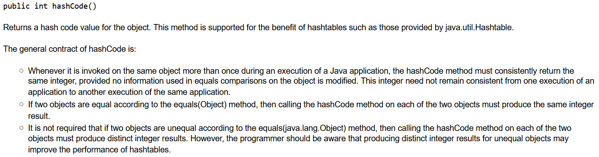

# Hashing

In den kommenden 2 Objekttypen kommt der Begriff Hash vor: `HashSet` und `HashMap`. Was bedeutet Hash?

Ein Hash ist die Umwandlung eines Objekts/Werts in eine `Zeichenkette einer bestimmten Länge`. Diese Zeichenkette stellt die Adresse (`Bucket`) dar, wo das Element innerhalb des Objekts zu finden ist. Da der Hashwert nicht in den urspünglichen Wert zurückverwandelt werden soll können (im Gegensatz zur Verschüsselung) wird kein Schlüssel benötigt.

## Vergleich mit anderen Objekttypen

Wenn wir uns an die LinkedList oder Arraylist erinnern: um einen Wert zu finden mussten wir die gesamte Liste durchlaufen, bis der Wert gefunden wurde. Im Falle eine Hash-Objekttyps funktioniert es anders: die Suche hasht den zu suchenden Wert und es kommt die entsprechende "Adresse" heraus. Da potenziell mehrere Elemente denselben Hash erhalten können, wird zuerst das `Bucket` gesucht (diese Suche ist sehr schnell) und anschließend innerhalb des Bucket müssen alle Elemente durchsucht werden. So erfolgt ein fast direkter Zugriff auf das Element.

Hier der Vergleich nochmals bildlich dargestellt:

**Suche in Arrays und Listen**:

**Suche in einem Hash-Objekt**:

**Vergleich der Suche in mehreren Objekttypen**:

In den meisten Fällen beinhaltet ein Bucket nur 1 Wert, so würde die Grafik stimmen.

## Anwendungsfälle

Hashing wird zu verschiedenen Zwecken verwendet:
- Zugriff auf Elementen in Hash-Objekttypen bzw. in Datenbanken (Indices)
- Speicherung von Passwörtern: sinnvoll, da das gespeicherte Passwort nicht entschlüsselt werden kann
- Bitcoin Mining: Zur Sicherstellung, dass die Blockchain nicht manipuliert wurde.
- ...

## Selbstentwickelte Klassen in HashSet hinzufügen

Möchte man ein Objekt einer selbstentwickelten Klasse in ein Hash-Objekttyp hinzufügen, so muss diese Klasse unbedingt folgende Methoden implementieren: `equals()` und `hashcode()`. 

Die Klasse `Object` liefert zwar eine Implementierung, allerdings bezieht sich diese nicht auf den Inhalt des Objekts, sodass 2 Objekte mit gleichem Inhalt 2 verschiedene Hashes bekommen. Daher ist es sinnvoll, diese Methoden zu reimplementieren, da Objekte, die als gleich gewertet werden sollen, denselben Hashcode aufweisen müssen. So können wir dafür sorgen, dass beim Vergleich zweier Objekte, nicht die Adresse im Speicher verglichen wird, sondern die einzelnen Werte des Objekts!

## Wie implementiert man die Methode hashcode()?

Schauen wir uns zuerst an, welche Anforderungen an die Methode hashcode() gestellt werden. Diese sind im haschcode-Contract beschrieben:

Abgesehen davon, damit die Nutzung eines Hash-Objekttyps einen Sinn macht, muss die Implementierung der `hashcode()`-Methode schnell und einfach sein. Ansonsten würde eine langsame Implementierung den Zugriff bzw. das Hinzufügen eines Elements verlangsamen und den Vorteil eines Hash-Objekttyps zunichte machen.

Zurück zur [Startseite](README.md)