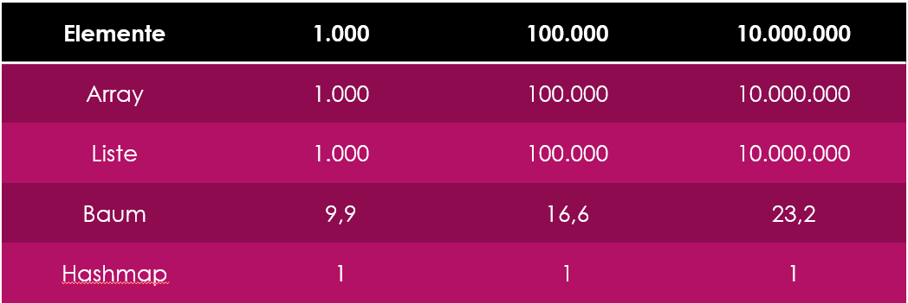

# Vergleich der kennengelernten Datenstrukturen

| Objekttyp  | fixe Größe | Reihenfolge    | Geschwindigkeit beim Hinzufügen/Löschen  | Geschwindigkeit beim zufälligen Zugriff | Spezifikum                                        |
| ********** | ********** | ************** | **************************************** | *************************************** | ************************************************* |
| Array      | Ja         | wie hinzufügen | nicht möglich, neues Array erstellen     | O(1)                                    | fixe Größe                                        |
| ArrayList  | Nein       | wie hinzufügen | eher schlecht, da Array im Hintergrund   | O(1)                                    | wie Array, aber dynamische Größe                  |
| LinkedList | Nein       | wie hinzufügen | O(1)                                     | O(n)                                    | schnell beim Hinzufügen/Löschen                   |
| TreeSet    | Nein       | sortiert       | O(log n)                                 | O(n)                                    | Element sortiert beim Hinzufügen                  |
| HashSet    | Nein       | wie hinzufügen | O(1)                                     | O(n)                                    | Elemente sind Objekte, keine primitive Datentypen |
| HashMap    | Nein       | Keys sortiert  | O(1)                                     | O(1)                                    | Key-Value, schnelle Erstellung bzw. Zugriffe      |

Hier ein weiterer Vergleich für die Suche eines Elementen:

Zurück zur [Startseite](README.md)